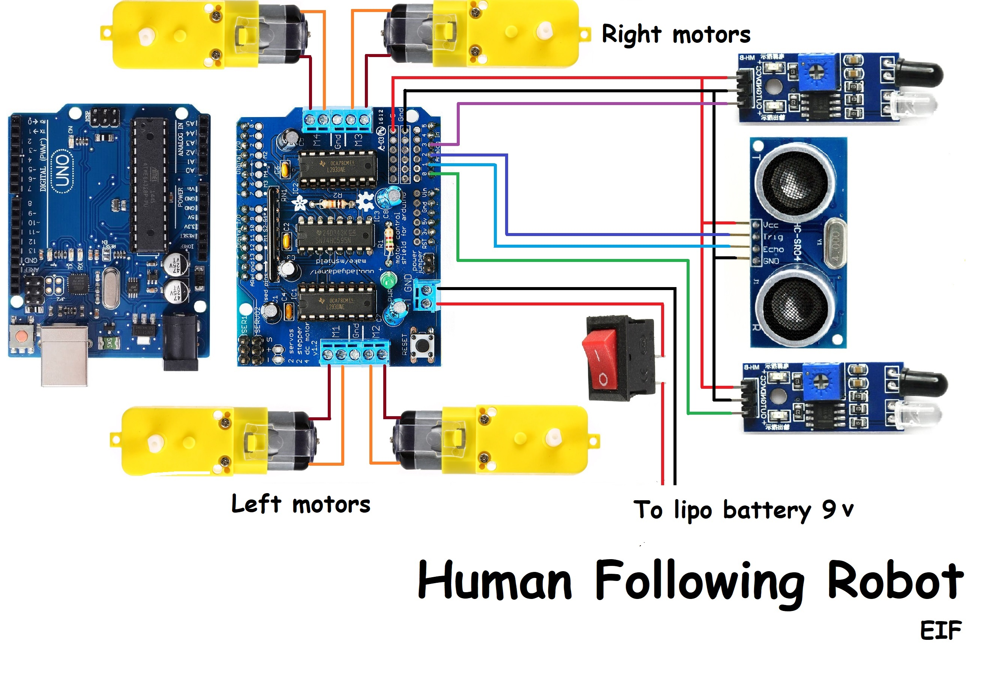
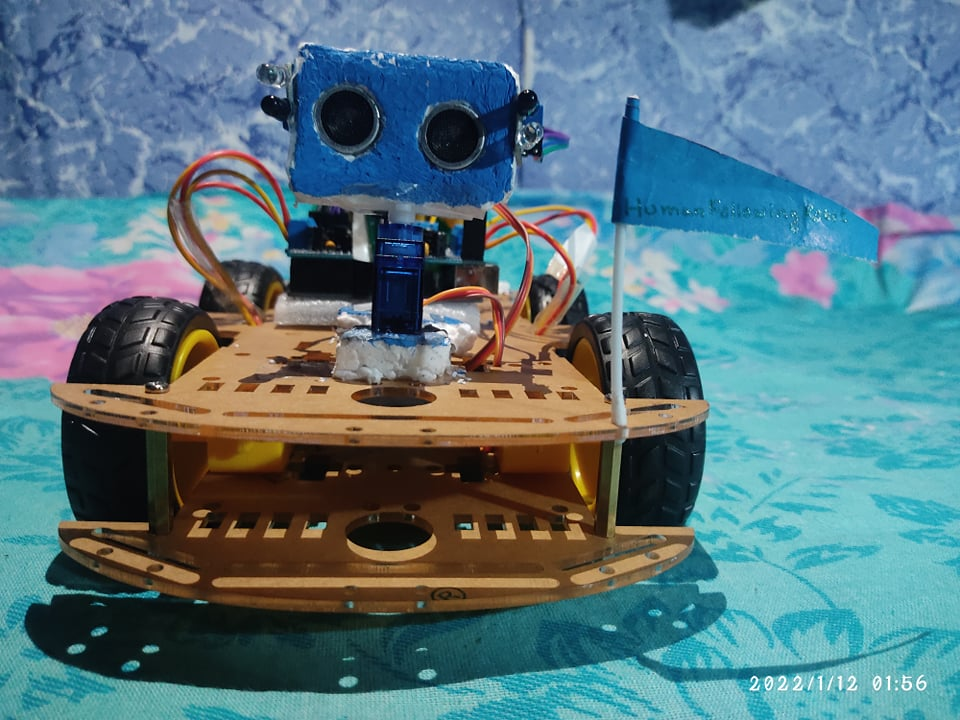
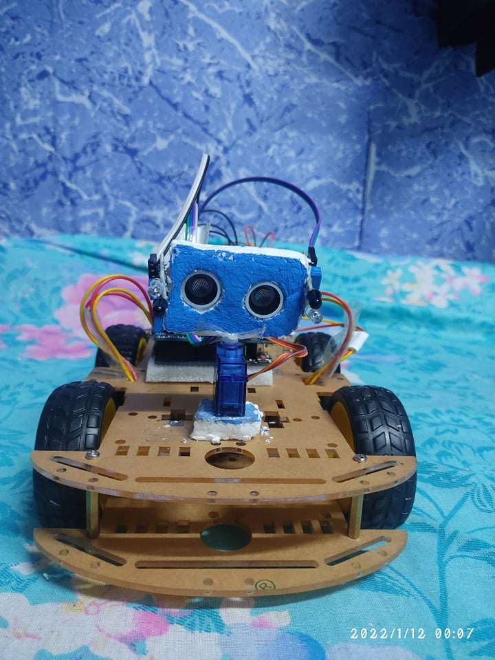
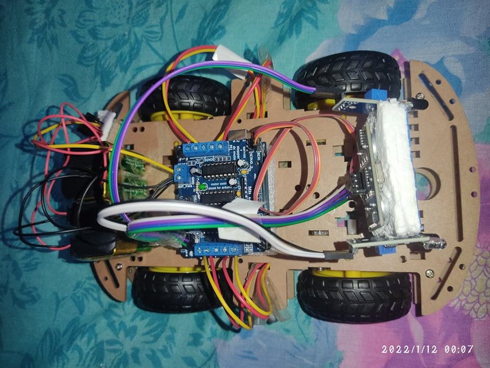
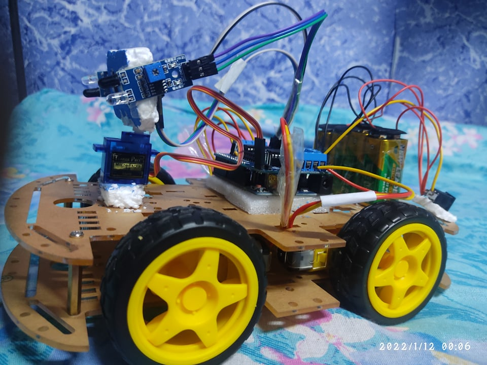
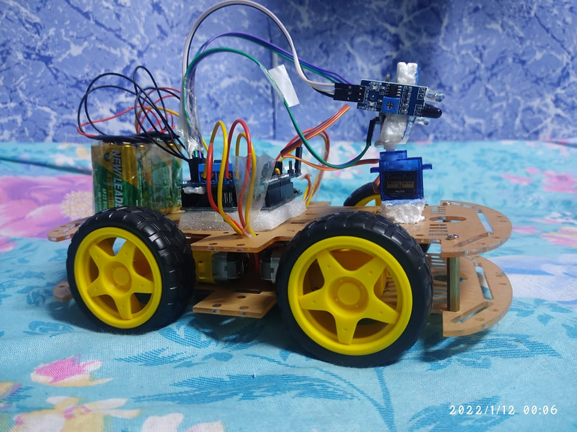

# Introduction

Many people think of robot as machine that imitates a human. However much these robots capture our imagination, such robots still only inhabit Science Fiction. People still have not been able to give a robot enough 'common sense' to reliably interact with a dynamic world. The human following robot uses 2 IR sensors and an ultrasonic sensor. IR sensors are used to follow the human or object and ultrasonic sensor is used to move back the robot.

# Objectives

This project focuses on the structure of a human following robot that follows any motion given.
The objectives of the project are as follows:

- To formulate an algorithm that keeps an approximate distance between the robot and the detected object when it is in motion.

- To construct a circuit design to interface all of the hardware components of the robot.

- To ensure that the hardware components of the robot are cost efficient.

# Design Strategy

- Arduino UNO
- Ultrasonic sensors
- Motor Driver Shield (L293D)
- DC Motor
- Infrared Sensor

# Plan of Action

The gear will have a connected double wire soldered to its node, and this process is repeated
three more times to create a quad motor. We will have to prepare a board made out a strong material for the body of the robot. Once it is done, we will attach the motors to the board and proceed to attach wheels to the board for the movement of the robot. The Arduino UNO mini board shall be attached to the middle of the board, and the motor driver will be attached to the op of it and fastened carefully. Once it has been fastened, wires will be connected to the designated ports and screwed in place. The servo motor which will be aiding in the movement of the motor can be placed in the front or the back of the body. An acrylic piece shall be attached to the servo motor for movement of the robot’s “head”. For the head, it will consist of ultrasonic sensors which will have infrared sensors attached to the side of the “head”. This will aid in the sensing of obstacles and motion. A four-colored wire will be mounted to the back of the ultrasonic sensor to be connected to the circuit and the Arduino. Once a battery holder has been attached to the body of the robot and its wires connected to the motor driver, the jumper cap and servo connector will be removed temporarily. This is to make sure that the program created in the Arduino IDE can be loaded in via USB successfully without any electrical short circuit.Once the program has been uploaded to the robot, the jumper cap and servo connector are
reattached. Lithium-ion batteries are to be used for this robot as it is necessary to be recharged
every now and then.

## Circuit Diagram

# Final Result

## Front Side :

## Upper Side :

## Left Side & Right Side:

# Development by

**1. A. B. M. Shifar Emtiuz**

**2. Md. Tahsin Amin**

### Department of Electrical and Electronic Engineering.

### Faculty of Computer Science and Engineering.

### Patuakhali Science and Technology University, Patuakhali
